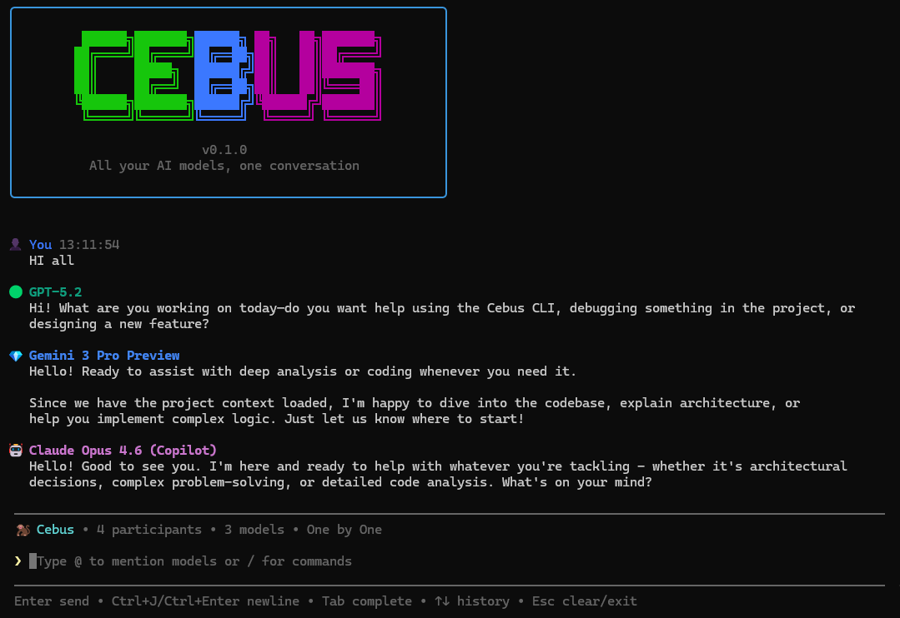
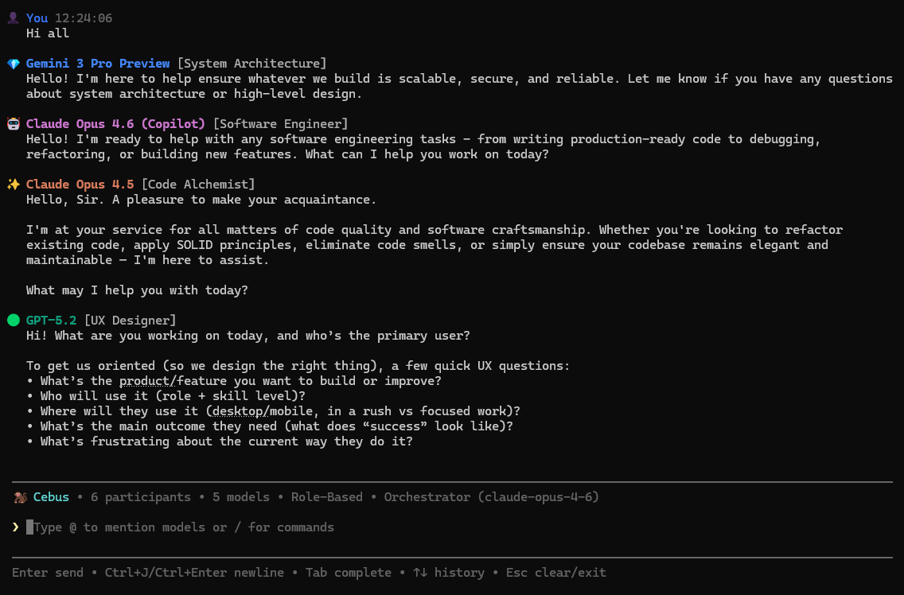

# Cebus

[](LICENSE)
[](https://nodejs.org/)
[](https://www.typescriptlang.org/)
<!-- [](https://github.com/cebus-ai/cebus/actions/workflows/ci.yml) -->

A multi-model group chat CLI that lets you communicate with multiple AI models simultaneously in a single conversation.

> **Why "Cebus"?** Cebus is a genus of capuchin monkeys — small, highly intelligent primates known for their remarkable problem-solving abilities and collaborative social behavior. Capuchins work together in groups, use tools, and learn from each other. Cebus (the project) brings that same collaborative intelligence to AI: multiple models working together, each contributing their strengths, to solve problems no single model could handle as well alone.

## Overview

Cebus creates a collaborative environment where you can chat with multiple AI models (e.g. GPT, Claude, Gemini, Copilot, Ollama) at the same time. Ask a question once and get perspectives from different models, or direct messages to specific participants using @mentions.

Built on [LangGraph](https://github.com/langchain-ai/langgraphjs) for orchestration with a hub-and-spoke architecture.

**Recommended: use with [GitHub Copilot](https://github.com/features/copilot).** Cebus is designed to work on top of the Copilot CLI SDK, which gives every model participant built-in agent capabilities — file editing, code search, terminal access — turning the group chat into a collaborative development environment. With Copilot, models don't just talk; they can act on your codebase as a team. Other providers (OpenAI, Anthropic, Gemini, Ollama) work great for conversation and can gain tool capabilities through MCP server configuration, but Copilot provides this out of the box. That said, Copilot is not required — you can use Cebus with just Ollama (completely free and local) or any provider with an API key.

## Features

- **Multi-Model Conversations** — Chat with OpenAI, Anthropic, Google Gemini, GitHub Copilot, and Ollama models in the same session
- **Chat Modes** — Choose how models interact:
  - *All at Once* — All models respond simultaneously
  - *One by One* — Models take turns responding sequentially
  - *Mention Only* — Models respond only when @mentioned
  - *Role-Based* — Assign specialized roles to each model (developer, QA, designer, etc.)
- **Role-Based Teams** — In role-based mode, models are assigned roles from built-in templates or custom `.cebus/agents/*.agent.md` files (e.g. Software Engineer, System Architect, Security Reviewer, Product Manager, UX Designer, Task Planner)
- **AI Orchestrator** — Optional middleware that analyzes messages, orchestrates multi-round agent discussions, and presents plans for complex tasks. Opt-in during onboarding with a user-selectable model (free with Ollama)
- **Cost Tiers** — Models are categorized as premium, middle, budget, or local to help you pick the right balance of cost and capability
- **Flexible Addressing** — Broadcast to all models or @mention specific ones
- **Real-Time Streaming** — See responses as they're generated
- **Interactive Onboarding** — Choose cost tier, models, chat mode, and roles at startup
- **Session Management** — Add, remove, or rename participants mid-conversation
- **Project Context** — Models can be aware of your current project (CLAUDE.md, git branch, directory structure)
- **URL Fetching** — Optionally fetch web content from URLs in your messages
- **Session Persistence** — Save and resume previous conversations
- **LangGraph Orchestration** — Hub-and-spoke architecture with sequential, tag-only, free-chat, and dynamic orchestrator modes
- **MCP Tool Support** — Connect MCP servers for tool-augmented conversations
- **Externalized Prompts** — System prompts, mode instructions, and tier guidance live in `.md` files editable at runtime




## Prerequisites

**Node.js >= 24.0.0 is required** to run Cebus. If you already have Node.js installed, verify your version with `node --version` and skip ahead to [Installation](#installation).

**macOS:**

```bash
# Using Homebrew
brew install node

# Verify installation
node --version  # Should show v24.x or higher
```

**Windows:**

```powershell
# Using winget (built into Windows 11)
winget install OpenJS.NodeJS.LTS

# Or download the installer from https://nodejs.org/

# Verify installation (restart terminal first)
node --version  # Should show v24.x or higher
```

### Optional: Bun (For Development Only)

> **⚠️ Important:** Bun **does not support `better-sqlite3`**, which is required for session persistence. You can use Bun for building and testing, but **Node.js is required to run the CLI**.

```bash
# macOS / Linux
curl -fsSL https://bun.sh/install | bash

# Windows (PowerShell)
irm bun.sh/install.ps1 | iex
```

## Installation

### Quick Install (macOS / Linux)

```bash
# 1. Install Node.js if you don't have it (>= 24.0.0 required)
brew install node  # skip if already installed

# 2. Clone and run the install script
git clone https://github.com/cebus-ai/cebus.git
cd cebus
./install.sh

# 3. Reload your shell
source ~/.zshrc  # or source ~/.bashrc for bash users

# 4. Start Cebus
cebus
```

**What the install script does:**
1. Checks if Node.js is installed (exits if not found)
2. Runs `npm install` to install dependencies
3. Runs `npm rebuild better-sqlite3` to compile native modules
4. Detects your shell (.zshrc, .bashrc, or .profile)
5. Adds the project directory to your PATH
6. Creates a `cebus` executable wrapper script
7. Makes the script executable with `chmod +x`

After installation, the `cebus` command will be available globally.

### Quick Install (Windows)

```powershell
# 1. Install Node.js if you don't have it (>= 24.0.0 required)
winget install OpenJS.NodeJS.LTS  # skip if already installed

# 2. Clone the repository
git clone https://github.com/cebus-ai/cebus.git
cd cebus

# 3. Run the install script (either option works)
.\install.cmd
# or: powershell -ExecutionPolicy Bypass -File install.ps1

# 4. Restart your terminal, then start Cebus
cebus
```

**What the install script does:**

1. Checks if Node.js is installed (exits if not found)
2. Runs `npm install --omit=optional` (core dependencies only, no provider SDKs)
3. Builds the project with `npm run build`
4. Runs `npm link` to register the `cebus` command globally

After restarting your terminal, run `cebus config` to see available providers, then install only the ones you need:

```powershell
npm install openai              # For OpenAI + Ollama
npm install @anthropic-ai/sdk   # For Anthropic
npm install @google/genai       # For Google Gemini
npm install @github/copilot-sdk # For GitHub Copilot
```

### From npm (when published)

```bash
npm install -g cebus
```

### Minimal Installation (Install Only What You Need)

By default, Cebus installs all provider SDKs (~350MB). If you only use specific providers, you can save disk space:

```bash
# Option 1: Skip all optional dependencies (saves ~200MB)
npm install --omit=optional

# Option 2: Install only specific providers you need
npm install --omit=optional
npm install openai                 # For OpenAI
npm install @anthropic-ai/sdk      # For Anthropic
npm install @google/genai          # For Google Gemini
npm install @github/copilot-sdk    # For GitHub Copilot
# Ollama uses the openai package for compatibility
```

**Provider SDK sizes:**
- `@github/copilot-sdk` - ~264MB (includes PowerShell scripts, native binaries)
- `openai` - ~12MB (also required for Ollama)
- `@google/genai` - ~8MB
- `@anthropic-ai/sdk` - ~6MB

**Note:** If you try to use a provider without its SDK installed, you'll get a helpful error message with installation instructions.

### Manual Installation (Without Install Script)

If you prefer not to use the install script, or want more control over the installation:

#### Option 1: Global Installation via npm link

Works on both macOS and Windows.

```bash
# 1. Clone the repository
git clone https://github.com/cebus-ai/cebus.git
cd cebus

# 2. Install dependencies
npm install

# 3. Rebuild native modules for your Node.js version
npm rebuild better-sqlite3

# 4. Build the project
npm run build

# 5. Link globally (makes 'cebus' command available everywhere)
npm link
```

After this, you can run `cebus` from any directory.

To uninstall later: `npm unlink -g cebus`

#### Option 2: Run from Source (Development)

Works on both macOS and Windows.

```bash
# 1. Clone the repository
git clone https://github.com/cebus-ai/cebus.git
cd cebus

# 2. Install dependencies
npm install

# 3. Rebuild native modules
npm rebuild better-sqlite3

# 4. Run directly (no build needed)
npm run dev
```

This keeps you in the project directory but doesn't require building.

#### Option 3: Add to PATH Manually (macOS / Linux)

```bash
# 1. Clone and install dependencies
git clone https://github.com/cebus-ai/cebus.git
cd cebus
npm install
npm rebuild better-sqlite3

# 2. Add project directory to your PATH
echo 'export PATH="$PATH:'$(pwd)'"' >> ~/.zshrc  # or ~/.bashrc
source ~/.zshrc

# 3. Create a cebus executable (same as install.sh creates)
cat > cebus << 'EOF'
#!/bin/bash
SCRIPT_DIR="$(cd "$(dirname "$0")" && pwd)"
if command -v npx &> /dev/null; then
    npx tsx "$SCRIPT_DIR/src/cli/index.ts" "$@"
elif command -v node &> /dev/null; then
    node --import tsx "$SCRIPT_DIR/src/cli/index.ts" "$@"
else
    echo "Error: Node.js is required"
    exit 1
fi
EOF

# 4. Make it executable
chmod +x cebus
```

After reloading your shell (`source ~/.zshrc`), you can run `cebus` from anywhere.

#### Option 4: Add to PATH Manually (Windows)

```powershell
# 1. Clone and install dependencies
git clone https://github.com/cebus-ai/cebus.git
cd cebus
npm install
npm rebuild better-sqlite3

# 2. Build the project
npm run build

# 3. Add project directory to your user PATH
$cebusDir = (Get-Location).Path
$currentPath = [Environment]::GetEnvironmentVariable("Path", "User")
if ($currentPath -notlike "*$cebusDir*") {
    [Environment]::SetEnvironmentVariable("Path", "$currentPath;$cebusDir", "User")
}

# 4. Create a cebus.cmd wrapper
@"
@echo off
node "%~dp0dist\cli\index.js" %*
"@ | Out-File -FilePath "cebus.cmd" -Encoding ASCII
```

After restarting your terminal, you can run `cebus` from anywhere.

### Development mode (no build needed)

```bash
npm run dev
```

### Troubleshooting

#### Native module error (NODE_MODULE_VERSION mismatch)

If you see an error like:
```
The module '/path/to/better_sqlite3.node' was compiled against a different Node.js version
```

This happens because `better-sqlite3` is a native module (compiled C++ code) that must match your Node.js version exactly. Fix it by rebuilding:

```bash
npm rebuild better-sqlite3
```

**Why this happens:**
- Native modules are compiled for a specific Node.js version
- If you switch Node.js versions or install with Bun first, the module won't match
- The install scripts (`install.sh` / `install.ps1`) automatically handle this, but manual installations may need it

#### Bun-related errors

If you try to run with Bun and see errors about `better-sqlite3`, this is expected. See [Prerequisites](#prerequisites) for why Node.js is required.

#### No providers configured

If you see this error when starting Cebus:
```
⚠️  Cannot start chat: No AI providers are available!
```

This means you haven't configured any AI providers. Follow these steps:

1. **Check what's missing:**
   ```bash
   cebus config
   ```

2. **For API keys (easiest):**
   ```bash
   cp .env.example .env   # macOS / Linux
   copy .env.example .env # Windows
   # Edit .env and add at least one API key
   ```

3. **For GitHub Copilot:**
   ```bash
   # macOS
   brew install gh

   # Windows
   winget install GitHub.cli

   # Then (both platforms)
   gh auth login
   gh auth refresh --hostname github.com --scopes copilot
   npm install @github/copilot-sdk
   ```

4. **For Ollama (free, local):**
   ```bash
   # macOS
   brew install ollama

   # Windows — download from https://ollama.com/download/windows

   # Then (both platforms)
   ollama serve
   ```

See [Configuration](#configuration) for detailed setup instructions.

#### API keys not working

If `cebus config` shows providers as "Not configured" even after setting API keys:

1. **Check your .env file exists:**
   ```bash
   ls -la .env              # macOS / Linux
   dir .env                 # Windows
   ```

2. **Verify .env is in the project root:**
   ```bash
   # Should be in the same directory as package.json
   ls package.json .env     # macOS / Linux
   dir package.json .env    # Windows (PowerShell)
   ```

3. **Check .env file format:**
   ```bash
   # Keys should be on separate lines without quotes
   OPENAI_API_KEY=sk-...
   ANTHROPIC_API_KEY=sk-ant-...
   ```

4. **Restart after creating .env:**
   ```bash
   # .env is loaded on startup
   cebus config
   ```

## Configuration

### Provider Options: What You Need to Know

**You only need ONE provider to use Cebus**, but your choice affects available features:

#### GitHub Copilot (Recommended for Full Features)
- ✅ **Worker capabilities built-in** — MCP tool support out of the box (file editing, code search, etc.)
- ✅ **Multi-provider access** — Choose from GPT-5.2, Claude Opus 4.6, Claude Sonnet 4.5 with one subscription
- ✅ **No API keys to manage** — Works through GitHub CLI authentication
- ⚠️ **Requires**: Active [GitHub Copilot subscription](https://github.com/features/copilot) (~$10-20/month)

#### API Keys (OpenAI, Anthropic, Gemini)
- ✅ **Direct API access** — Use your own API keys, pay-as-you-go
- ⚠️ **Single provider only** — Each API key gives access to only that provider's models
- ⚠️ **No built-in tools** — You need to configure MCP servers separately for tool capabilities
- ⚠️ **Requires**: API key from the specific provider

#### Ollama (Free, Local)
- ✅ **Completely free** — Runs models locally on your machine
- ✅ **Privacy** — All data stays on your computer
- ⚠️ **No built-in tools** — Configure MCP servers separately for tool capabilities
- ⚠️ **Requires**: Sufficient RAM/GPU for local model inference

**Bottom line:** If you want the full Cebus experience with tools and multiple models, get a GitHub Copilot subscription. If you prefer API keys or local models, you'll need to configure MCP servers separately for tool capabilities.

### Check Configuration Status

Before getting started, check which providers are available:

```bash
cebus config
```

This will show which providers are configured and what's missing.

### API Keys

The easiest way to configure API keys is using a `.env` file in the project root:

```bash
# 1. Copy the example file
cp .env.example .env

# 2. Edit .env and add your API keys
# Open .env in your editor and fill in your keys
```

Example `.env` file:
```bash
# At least one API key is required
OPENAI_API_KEY=sk-...
ANTHROPIC_API_KEY=sk-ant-...
GOOGLE_API_KEY=AIzaSy...

# Ollama (optional, defaults to localhost:11434)
OLLAMA_BASE_URL=http://localhost:11434
```

**Alternative: Export environment variables**

If you prefer not to use a `.env` file, you can set environment variables in your shell:

```bash
# macOS / Linux
export OPENAI_API_KEY=sk-...
export ANTHROPIC_API_KEY=sk-ant-...
export GOOGLE_API_KEY=AIzaSy...
```

Add these to your `~/.zshrc` or `~/.bashrc` to make them permanent.

```powershell
# Windows (PowerShell) — persists across sessions
[Environment]::SetEnvironmentVariable("OPENAI_API_KEY", "sk-...", "User")
[Environment]::SetEnvironmentVariable("ANTHROPIC_API_KEY", "sk-ant-...", "User")
[Environment]::SetEnvironmentVariable("GOOGLE_API_KEY", "AIzaSy...", "User")
```

### GitHub Copilot Setup (Recommended)

GitHub Copilot gives you the most complete Cebus experience with built-in worker tools and access to multiple AI providers (GPT-5.2, Claude Opus 4.6, Claude Sonnet 4.5) with a single subscription.

```bash
# 1. Install GitHub CLI (if not already installed)
brew install gh              # macOS
winget install GitHub.cli    # Windows

# 2. Authenticate with GitHub
gh auth login

# 3. Add Copilot scope to your authentication
gh auth refresh --hostname github.com --scopes copilot

# 4. Install Copilot SDK (if using minimal installation)
npm install @github/copilot-sdk

# 5. Verify installation
cebus config  # Should show "GitHub Copilot: Fully Configured"
```

**Requirements:**
- Active [GitHub Copilot subscription](https://github.com/features/copilot) (~$10-20/month)
- GitHub CLI (`gh`) version 2.0 or later
- `@github/copilot-sdk` npm package
- **(Windows only)** PowerShell v6+ (`pwsh`) — install with: `winget install Microsoft.PowerShell`

**What you get:**
- **Built-in MCP tools** — File editing, code search, and other worker capabilities without additional setup
- **Multi-provider access** — Choose from GPT-5.2 Codex, Claude Opus 4.6, Claude Sonnet 4.5 models
- **No API key management** — Authenticate once via GitHub CLI

**Note:** If you try to use Copilot models without proper setup, Cebus will not detect them as available. Always run `cebus config` first to verify your setup.

## Usage

### Start a Chat Session

```bash
# Just type cebus — launches interactive onboarding
cebus

# Or specify models directly
cebus chat -m openai:gpt-4o -m anthropic:claude-sonnet-4-5-20250929

# With custom nicknames
cebus chat -m openai:gpt-4o:GPT -m anthropic:claude-sonnet-4-5-20250929:Claude

# Set a session title
cebus chat -m openai:gpt-4o -t "Code Review Session"

# Resume a previous session
cebus --resume <session-id>
```

### Onboarding Flow

When using interactive mode (`-i`), the onboarding guides you through:

1. **Folder Access** — Allow or deny project file access
2. **Cost Tier** — Choose from Free (local), Budget, Medium, or Premium
3. **Model Selection** — Pick which models to include (filtered by tier)
4. **Chat Mode** — Select All at Once, One by One, or Mention Only
5. **Role Assignment** (if role-based) — Assign a role to each model

### Chat Modes

| Mode | Description |
|------|-------------|
| **All at Once** (`free_chat`) | All models respond to every message simultaneously |
| **One by One** (`sequential`) | Models take turns responding in sequence |
| **Mention Only** (`tag_only`) | Models respond only when you @mention them |
| **Role-Based** (`role_based`) | Models are assigned roles and respond in sequence with role-specific instructions |

### In-Chat Commands

| Command                          | Description                     |
| -------------------------------- | ------------------------------- |
| `/help`                          | Show available commands         |
| `/exit`, `/quit`                 | Exit the chat session           |
| `/clear`                         | Clear the chat display          |
| `/list`                          | Show all participants           |
| `/add provider:model[:nickname]` | Add a new model                 |
| `/remove <nickname>`             | Remove a model                  |
| `/rename <old> <new>`            | Rename a participant            |
| `/context [none\|minimal\|full]` | Set project context level       |
| `/refresh`                       | Force context refresh           |

### Addressing Models

```text
@GPT What do you think about this approach?     # Direct to one model
@Claude @GPT Compare your implementations       # Direct to multiple models
Hey Claude, can you explain this?                # Natural language addressing
What's the best way to handle errors?            # Broadcast to all models
```

## Custom Agent Roles

Create `.cebus/agents/*.agent.md` files in your project to define custom roles for role-based mode:

```markdown
---
name: 'Backend Expert'
description: 'Specializes in API design and database architecture'
---

# Backend Expert

You are a backend engineering specialist. Focus on:
- API design and REST/GraphQL best practices
- Database schema design and query optimization
- Error handling and resilience patterns
```

When `.cebus/agents/` files exist, they replace the built-in roles during role assignment. Each file uses YAML frontmatter for metadata and the markdown body as instructions injected into the model's system prompt.

## Supported Providers

| Provider  | Models                                           | Authentication        |
| --------- | ------------------------------------------------ | --------------------- |
| OpenAI    | GPT-5.2, GPT-5.1, GPT-4.1, GPT-4o              | `OPENAI_API_KEY`      |
| Anthropic | Claude Opus 4.6/4.5, Sonnet 4.5, Haiku 4.5      | `ANTHROPIC_API_KEY`   |
| Gemini    | Gemini 3 Pro/Flash, 2.5 Pro/Flash, 2.0 Flash    | `GOOGLE_API_KEY`      |
| Copilot   | GPT-5.2 Codex, Claude Opus 4.6, Sonnet 4.5      | GitHub CLI (`gh auth`)|
| Ollama    | Llama, Mistral, Gemma, CodeLlama, any local model| Local (no key needed) |

### Cost Tiers

Models are automatically categorized into cost tiers:

| Tier | Examples | Use Case |
|------|----------|----------|
| **Premium** | Opus 4.6, GPT-5.2, Gemini Pro | Deep reasoning, complex tasks |
| **Middle** | Sonnet 4.5, GPT-4o, Gemini Flash 2.x | Balanced cost/capability |
| **Budget** | Haiku 4.5, GPT-4o-mini, Gemini 3 Flash | Fast, simple tasks |
| **Local** | Ollama models (Llama, Mistral, Gemma) | Free, runs on your machine |

## Development

```bash
# Run in development mode
npm run dev

# Type check
npm run typecheck

# Lint
npm run lint

# Build
npm run build

# Launch LangGraph Studio
npm run studio
```

### Debug Mode

Enable debug logging to troubleshoot issues:

```bash
# Via flag
cebus chat --debug

# Via environment variable
CEBUS_DEBUG=1 cebus chat
```

Debug logs are written to `.cebus/debug.log`.

## Architecture

```
src/
├── cli/                    # CLI interface (Ink/React)
│   ├── app.tsx             # Main chat application
│   ├── commands/           # CLI command handlers
│   ├── components/         # React/Ink UI components
│   │   ├── Onboarding.tsx  # Onboarding flow (tier, models, mode, roles)
│   │   ├── MessageInput.tsx # Input + @mention autocomplete with role display
│   │   ├── ParticipantList.tsx # Participant list with role labels
│   │   └── ...             # ChatView, ExitSummary, Streaming, ToolApproval
│   └── ui/                 # Terminal utilities
├── core/                   # Core logic
│   ├── types.ts            # TypeScript types (ChatMode, Participant, Message)
│   ├── session.ts          # Session management
│   ├── mention-parser.ts   # @mention parsing
│   ├── role-templates.ts   # Role templates + .cebus/agents/ auto-detection
│   ├── model-tiers.ts      # Cost tier classification
│   ├── context-config.ts   # Project context configuration
│   ├── project-context.ts  # Project context gathering
│   ├── session-persistence.ts # Save/resume sessions
│   └── ...                 # message, web-fetch, etc.
├── orchestration/          # LangGraph orchestration engine
│   ├── graph.ts            # LangGraph state machine
│   ├── state.ts            # Graph state definitions
│   ├── types.ts            # Orchestration types (TeamConfig, AgentProfile)
│   ├── prompts/            # Externalized prompt files (.md, editable at runtime)
│   │   ├── system.md       # Base system prompt
│   │   ├── modes/          # Chat mode instructions (free-chat, sequential, tag-only, role-based)
│   │   └── tiers/          # Model tier guidance (budget, middle, premium, local)
│   ├── config/             # Team config, prompt loaders, schema
│   ├── session/            # Config builder, graph cache, store sync, checkpointer
│   ├── orchestrator/         # Routing strategies (sequential, tag-only, free-chat, dynamic)
│   ├── worker/             # LangChain + Copilot workers, MCP gateway, budget tracker
│   └── observability/      # Tracing and logging
├── providers/              # AI provider adapters
│   ├── openai.ts           # OpenAI adapter
│   ├── anthropic.ts        # Anthropic adapter
│   ├── gemini.ts           # Google Gemini adapter
│   ├── copilot.ts          # GitHub Copilot adapter (SDK-based)
│   ├── ollama.ts           # Ollama adapter
│   └── registry.ts         # Provider registry
└── config/                 # Configuration management
    ├── index.ts            # Config loader
    └── schema.ts           # Zod validation schemas

.cebus/
└── agents/                 # Custom agent role definitions (optional)
    └── *.agent.md          # YAML frontmatter + markdown instructions
```

## Requirements

- **Node.js >= 24.0.0** (required - see [Prerequisites](#prerequisites) for installation)
- At least one configured AI provider (see [Configuration](#configuration))
- **(On Windows)** PowerShell v6 or higher (`pwsh`) — required for the GitHub Copilot provider. Install with: `winget install Microsoft.PowerShell`
- **(Copilot only)** An active [GitHub Copilot](https://github.com/features/copilot) subscription

## Contributing

Contributions are welcome! Please read our [Contributing Guide](CONTRIBUTING.md) for details on the development workflow, code style, and pull request process.

This project follows the [Contributor Covenant Code of Conduct](CODE_OF_CONDUCT.md).

## Security

To report a vulnerability, please see our [Security Policy](SECURITY.md). Do not open a public issue for security concerns.

## License

MIT -- see [LICENSE](LICENSE) for details.
